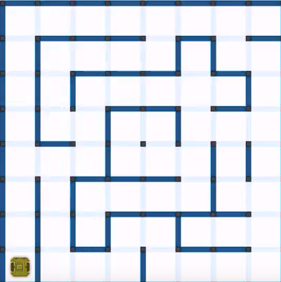

|build| |coverage| |requirements|

Optical Micromouse Maze Recognition
===================================

This project aims to ease the process of creating maze files simply using
images of micromouse mazes.

Usage
-----

Install it with::

   pip install ommr

Run it with::

   ommr input_image.png

The generated output file complies with the standard micromouse maze text
format.  For more information visit `micromouseonline/mazefiles
<https://github.com/micromouseonline/mazefiles>`_.

Image requirements
------------------

This software is currently very limited, so the input image must meet some
requirements:

- There should be a good contrast between background and walls.
- The maze image must be regular. That means, maze boundaries should look all
  straight and parallel or perpendicular to each other.
- The maze image must be cropped manually so that top and left boundary walls
  are included and bottom and right boundary walls are excluded.

Here is an example of a suitable 8x8 input maze image:

Note that the closer you get to the walls when cropping, the better. No need
to be exact though nor use any complex image manipulation tool. Taking a
screenshot of the area with some care should be enough.

If you use GNU/Linux you might be able to take area screenshots by simply
pressing ``MAYUS + PRINT`` and then selecting the area on your screen.
Screenshots should appear on your home "Pictures" folder.

Command line options
--------------------

You can list the command line options with::

   ommr --help

The ``--size`` option specifies the size of the maze (i.e.: 16, 32...).

The ``--output`` specifies where to store the generated file:

- If ommited, the output file will be created in the same directory as the
  input file, using the input file name but changing the file extension to
  `.txt`.
- If the output is a directory, the same input file name will be used but the
  file will be created inside the specified output directory.
- If the output is not a directory it will be used as the output file name.

.. |build|
   image:: https://api.travis-ci.org/Theseus/ommr.svg?branch=master
      :target: https://travis-ci.org/Theseus/ommr
      :alt: Build badge
.. |coverage| image:: https://codecov.io/github/Theseus/ommr/coverage.svg?branch=master
      :target: https://codecov.io/github/Theseus/ommr
      :alt: Coverage badge
.. |requirements| image:: https://requires.io/github/Theseus/ommr/requirements.svg
      :target: https://requires.io/github/Theseus/ommr/requirements/
      :alt: Requirements badge
